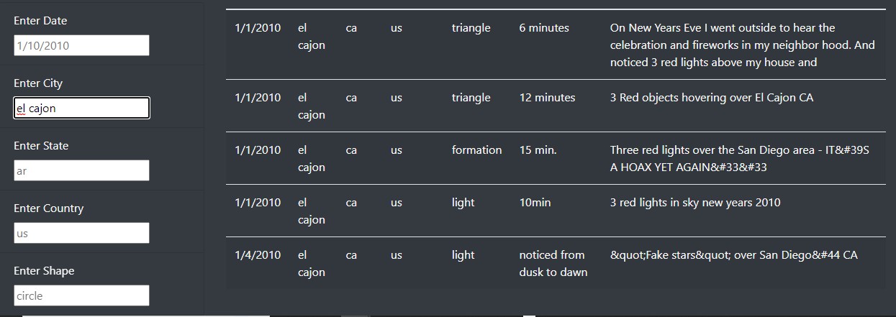
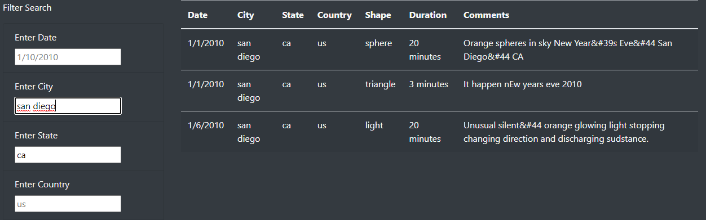
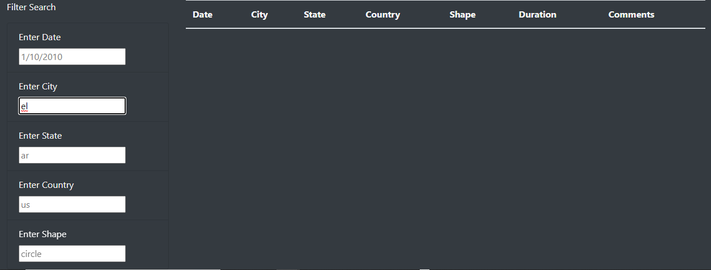
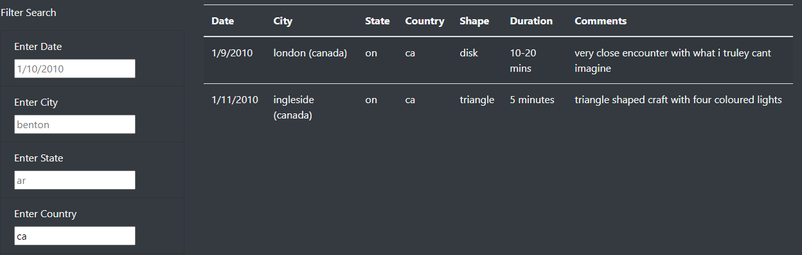
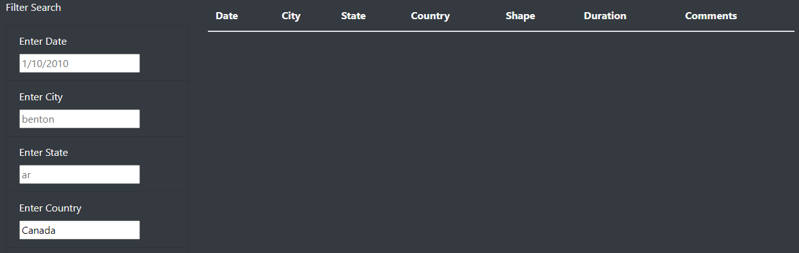

# UFOs
## Overview

The purpose of this project was to create a dynamic web page capable to filtering and returning searched data. The users of this web page needed to be able to use multiple search criteria at the same time to narrow their results and provide meaninggul data.

## Results

### City Search
As shown in the image above, typing in the relevent criteria will return all data associated with the input value. In our example, el cajon was the searched city and all data associated with this city was returned. It includes the state, date of sighting, shape of the UFO, duration of sighting and any comments.

### Multiple Criteria
The data on the site can made more specific if multiple filters are used. In the example above the city of San Diego and the state of California were searched. While there were other sightings in the state of California entering a specific city narrowed the search. The same can be done for the other filters, such as searching for San Diego sighting on a specific date by using the city and date filters.

## Summary

### Drawbacks

The webpage is not dynamic enough to include partial searches per filter. As shown below, if I wanted to seacrh for cities starting with "el" no results would appear. However, typing the full city name of "el cajon" yields results.

The same goes for any country searches. Typing "ca" in the search results will return data for Canada. This may be frustrating for users since the names of multiple countries may begin with "ca". Also typing the full name of the country will not work. Canada was typed in the country input box and returned no results.

### Recommendations

* The data and website should be made to include partial searches to resolve the previously stated issues.
* The website should include a section for users to add or submit their sightings.
* The site is limited to the data given. A larger database should be used to include more UFO sightings.

